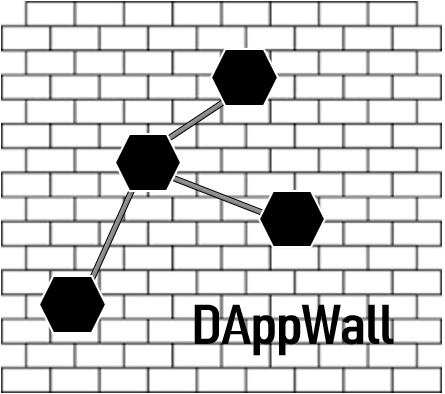

<h2> Inspiración </h2>

Crear una red más segura con DAppNode

  <h2> ¿Qué hace? </h2>
  

* DAppWall es una DApp para DAppNode que permite crear listas de nodos. Con un proceso de governanza se determina si un nodo (su ip o su id) pasa a formar parte de una *blacklist/whitelist*. En función de esa lista, DAppWall genera su firewall. 

* DAppWall utiliza una sistema de gobernanza mediante una DAO en Aragon (pudiendo verificar su identidad con Uport) en el cual, la comunidad decidirá quien entra en la lista negra o blanca. En otras palabras, cada nodo decide que nodos van en su lista negra o blanca, estos nodos luego compartirán sus listas para ponerlos en la lista principal, la cual DAppWall usará para construir firewall. 

* Permite crear una lista de nodos federados o una red de confianza.

* También permite crear una estructura de protección para nodos que lo necesiten, ocultando así los nodos más sensibles.

  <b> ¿Cómo lo hemos construido? </b>

 Nuestro objetivo es construir el front-end con HTML5 y Bootstrap, el back-end con IP-tables (gobernado por un smartContract).

  <b> Obstáculos encontrados </b>

Crear la DAO ha sido lo más complejo, escribir los contractos también a nos ha causado problemas debido a la complejidad de las reglas elejidas.
 

  <b> ¿Qué hemos aprendido? </b>

Como usar Aragon y crear una DApp para DAppnode con su sdk

