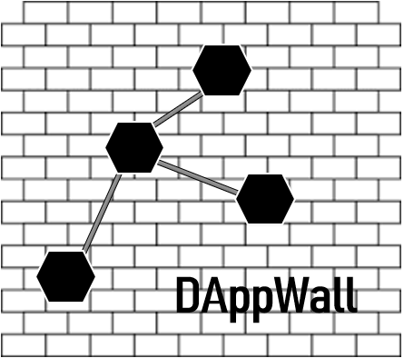

<h2> Inspiration </h2>

To create a safe net in the DAppNode

  <h2> What it does </h2>
  

The basic functionality of DAppWall is to create a centralized system of access that will be register on a immutable net of nodes from DAppNode at which you could connect to.

DAppWall will follow a system of social acceptance where the community will decide which nodes won't go to the black list and which one will. In other words , each node decides which nodes go to its black and white list , this lists will be added to the community one , the one DAppWall will feed from to create its firewall.

  <b> How we built it </b>

The objective it is to build it with react for the front end, for back end we will use the ip tables, a smart-contract and Swarm.
We will also bundle our DApp to be able to work with DAppNode, and it will be an Uport ID to sign and Aragon DAO to vote.

  <b> Challenges we ran into </b>

Conect Metamask, the Smart Contract, Swarm and DAppNode has been really the main issue setting up due to the complexity of the rules we are trying to set up. Aragon and Uport we will connect it in the future to complete the governance.
 

  <b> Acomplishments </b>

We learn about Web3, DappNode, Uport, Aragon and all its process and sending packages to the DAppNode. 

